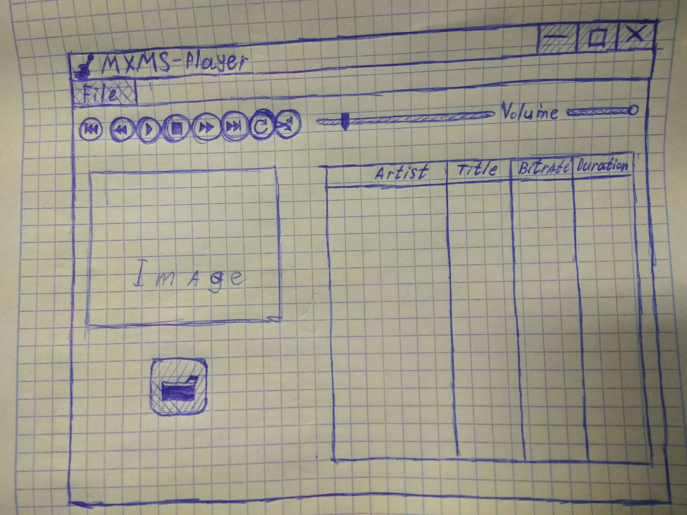

# Требования к проекту
---

# Содержание
1 [Введение](#intro)  
  1.1 [Назначение](#appointment) 
  1.2 [Бизнес-требования](#business_requirements)  
    1.2.1 [Исходные данные](#initial_data) 
    1.2.2 [Границы проекта](#project_boundary) 
  1.3 [Аналоги](#analogues) 
2 [Требования пользователя](#user_requirements)   
2.1 [Программные интерфейсы](#software_interfaces)  
  2.2 [Интерфейс пользователя](#user_interface)  
  2.3 [Характеристики пользователей](#user_specifications)  
    2.3.1 [Классы пользователей](#user_classes)   
   2.4 [Предположения и зависимости](#assumptions_and_dependencies)    
3 [Системные требования](#system_requirements)  
  3.1 [Функциональные требования](#functional_requirements)    
    3.1.1 [Основные функции](#main_functions)    
    3.1.2 [Ограничения и исключения](#restrictions_and_exclusions)   
  3.2 [Нефункциональные требования](#non-functional_requirements)    
    3.2.1 [Атрибуты качества](#quality_attributes)  
      3.2.1.1 [Требования к удобству использования](#requirements_for_ease_of_use)  
      3.2.1.2 [Требования к безопасности](#security_requirements)   
    3.2.2 [Внешние интерфейсы](#external_interfaces) 
    3.2.3 [Ограничения](#restrictions)  

<a name="intro"/>

# 1 Введение

<a name="appointment"/>

## 1.1 Назначение
В этом документе описаны функциональные и нефункциональные требования к приложению «MXMS-player». Документ предназначен для команды, которая будет реализовывать и проверять корректность работы приложения. 

<a name="business_requirements"/>

## 1.2 Бизнес-требования

<a name="initial_data"/>

### 1.2.1 Исходные данные
На сегодняшний день многие люди слушают музыку. Часто одна и та же музыка надоедает, поэтому многим может быть полезно приложение, которое будет не только давать возможность прослушивать музыку, но и собирать и обрабатывать статистику и ее прослушивании и выдавать рекомендации.

<a name="project_boundary"/>

### 1.2.2 Границы проекта
Приложение «MXMS-player» позволит его пользователям прослушивать треки, находящиеся в памяти его Desktop-устройства.

<a name="analogues"/>

## 1.3 Аналоги
Обзор аналогов представлен в документе [Overview of analogues](../Requirements/Overview%20of%20analogues.md).

<a name="user_requirements"/>

# 2 Требования пользователя

<a name="software_interfaces"/>

## 2.1 Программные интерфейсы
Приложение проигрывает аудиофайлы с расширением .mp3, а также, обменивается данными с сайтом Last.fm с помощью веб-запросов. 

<a name="user_interface"/>

## 2.2 Интерфейс пользователя
Окно входа в приложение.  
  
Окно авторизации на сайте.  
  
<a name="user_specifications"/>

## 2.3 Характеристики пользователей

<a name="user_classes"/>

### 2.3.1 Классы пользователей

| Класс пользователей | Описание |
|:---|:---|
| Анонимные пользователи | Пользователи, которые не желают авторизироваться во внешнем сервисе. Имеют доступ к частичному функционалу |
| Авторизированные пользователи | Пользователи, авторизированные на сайте Last.fm, которые желают отправлять данные о прослушанных треках во внешний сервис. Имеют доступ к полному функционалу |

<a name="assumptions_and_dependencies"/>

## 2.4 Предположения и зависимости
1. Приложение не взаимодействует со внешними сервисами при отсутствии подключения к сети Интернет;
2. Приложение обрабатывает только mp3-аудиофайлы.
